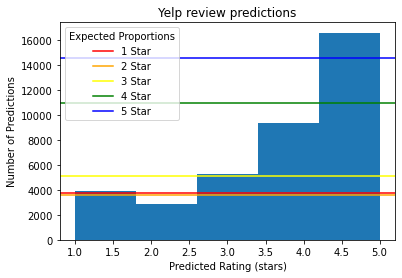
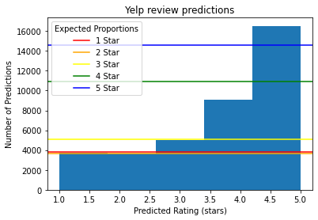
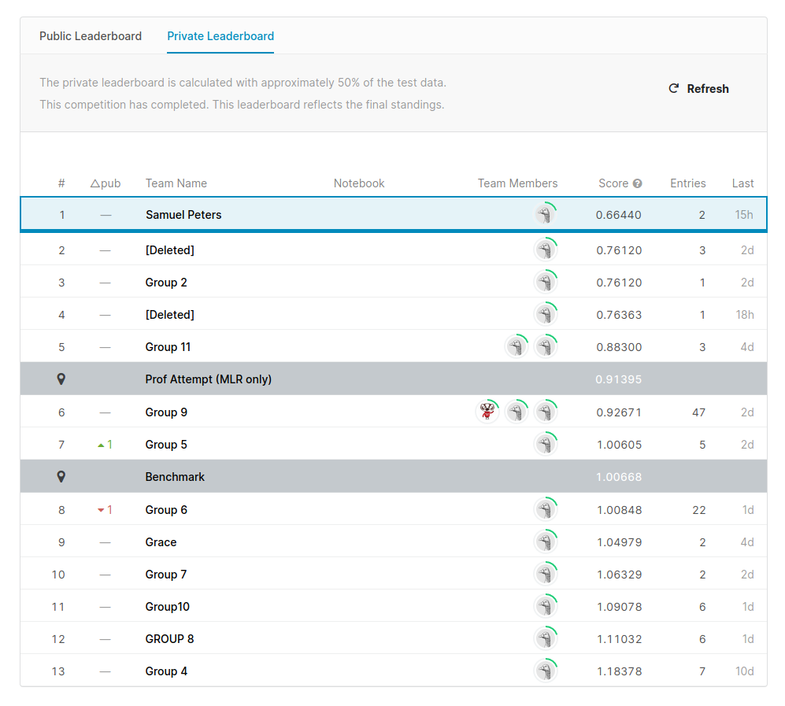

# Logistic Regression for Yelp Dataset
Predicting Yelp ratings by using the text of reviews.

## Background
This program aims to create a model that predicts the star ratings of Yelp 
reviews from restaurants near Madison, WI. The final model placed first 
in my UW-Madison Stat 333 class' Kaggle competition.

## The Data
We were given 57,008 reviews that consisted of the star rating, text, city, 
postal code, number of words and characters, number of 'positive' and 
'negative words', as well as term frequency for 500 words of each review. We 
were also given a similar dataset of 38,005 entries for which we had to predict 
the star ratings. I decided to preprossess the text on my own using the text of 
the reviews, rather than using the provided predictors. Note that here I've only 
uploaded the processed versions due to file size restrictions.

## My Process
First, I (naively) started by creating my own implementation of a Naive Bayes 
classifier using a bag of words approach. At its best it could achieve an 
rmse of 1.2 while taking a good deal of time. To its credit, it did only 
classify discrete 1-5 values which was not the best for rmse.

Next, I looked to Scikit-learn's repertoire of model creation software. I 
started by vectorizing the text into a tf-idf matrix. Then, I split the 
data into a 75:25 training:testing ratio. Lastly, I implemented SMOTE oversampling 
and fit the model to the training data. I would spend quite a while trying out 
various models with various parameters. Even though I abandoned many model 
types after finding success with Logistic Regression, here are the scores of some 
models I tried:

| Model Type			| Root Mean Squared Error	|
|-------------------------------|-------------------------------|
| `Multinomial Naive Bayes`	| 0.8115149239086666		|
| `XGBoost Classifier`		| 0.7817620124917976		|
| `Logistic Regression`		| 0.6694512778569809		|
    
## The Final Model
    Type: Logistic Regression
    Tokens: 1-grams through 5-grams
    Document Frequency: 4 documents - 50% of documents
    Resampling: SMOTE 'not minority'
    C Inverse Regularization: 5
    Penalty: elaticnet of 0.5
    Max # iterations to converge: 1000
    Time to build: 1:03:36
    25% test RMSE: 0.6694512778569809
    Kaggle Public RMSE: 0.66942
    Kaggle Private RMSE: 0.66440

From the above image, one can see that the model predicted approximately 
the number of 1 and 3 star reviews that we would expect. 2 star reviews were 
close, while 4 and 5 stars were under and over predicted, respectively. 
This makes sense as we use continuous values for our predictions, and the 
differences between 1 and 2 star as well as 4 and 5 star reviews is slight. 

Models that were built with different oversampling techniques provided 
similar rmse scores while producing interesting differences in the graph. 
For example, take the above graph which was constructed with a 'not majority' 
oversampling technique. It appears to fit the data much better, but provides a 
slightly worse rmse of 0.6797. This is likely due to values being right on the 
boundary of two values, so a slight change will drastically change the graph, 
while not equating to any actual gain in performance.

## Final Remarks
While the model performs well, it could still do with some improvement.
For one, the model parameters could be tuned with more accuracy, though I argue
with diminishing returns. Tuning the regularization strength on smaller values 
(larger C) could improve the score, though an increase from 4 to 5 saw small gains and 
roughly 3 times the running time. Also, I was unable to give the solver and 
penalty combinations sufficient attention. I think that tree-based models 
such as XGBoost and Random Forest have promise, yet I didn't have the time 
nor resources to explore those options sufficiently. After I created the final 
model, I adjusted the code so that the testing set was not used for tf-idf 
vectorization. This makes the code more modular and easier to predict on any 
set, though it changes the model results slightly.

## File Directories
| Directory Name | Description						|
|----------------|------------------------------------------------------|
| `./`		 | The logistic regression model and file parser.	|
| `./lib`	 | Helper functions for the model to run.		|
| `./Datasets`	 | Datasets for the model, to be parsed.		|
| `./Models`	 | Trained logistic regression models.			|
| `./Predictions`| CSV files of predicted Yelp ratings.			|
| `./Vectors`	 | Tf vectorizer and tf-idf matrix for the training set.|
